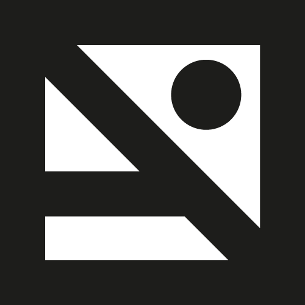

# Mario Carballo Zama

## Experience
- Co-founder of Punto y coma January 2013 - January 2014.
- Nyx Technology February 2013 - September 2014.
- HyperBeard Games May 2014  - present.
- Apps-O-Rama Febrary 2015 - present.
- Arlefreak as a freelancer.

### Punto y coma 
- Front and back end development forColegio Andersen.

### Nyx Technology

- Front end development for the companies web page overhaul Nyxtechnology.
- Front end development for the 2013 Festival Internacional Cervantino.
- Interface design and development for the android app for the: Festival Internacional Cervantino 2013.
- Interface design and development for the android app for the: Festival Internacional de cine de Acapulco 2013.
- Development for the redesigned interface for the National Auditorium 2013 app.
- Development for the redesigned interface for the Lunario 2013 app.
- Back end development using wordpress platform for the author's Gabriel Zaid.

### HyperBeard Games
- Front and back end development for HyperBeard Games website.
- Game development on Bouncing Dude.
- Game development on Palabraz.
- Game development on Muertitos.
- Game development on Space Scape.

### Apps-O-Rama
- Calculator Cute

### Arlefreak
- Luis Quiroz front and back end development
- ASP front and back end development asp.mx
- Ixaya front and back end development ixayacondesa.com
- Monica Patiño front and back end development 
- Casa virginia and back end development
- Delirio & Abarrotes and back end development

## References & Contact
<ul class="left">
    <li>hi@arlefreak.com</li>
    <li>github.com/Arlefreak</li>
    <li>lnkd.in/99e6bA</li>
    <li>nyxtechnology.com</li>
    <li>hyperbeard.com</li>
    <li>appsorama.com</li>
    <li>arlefreak.com</li>
</ul>
<ul class="right">
    <li>colegioandersen.edu.mx</li>
    <li>festivalcervantino.gob.mx</li>
    <li>luisquiroz.me</li>
    <li>asp.mx</li>
    <li>ixayacondesa.com</li>
    <li>casavirginia.mx</li>
    <li>delirio.mx</li>
</ul>

## Education
- B.D. in  Digital Animation at Universidad Panamericana campus Ciudad de México.
- Currently majoring in Project Administration at Universidad Panamericana campus Ciudad de México

### Languages
- Spanish: Native speaker
- English: Passed TOEFL test in 2010
- French: Intermediate level I

## Skills

### Front End
- Html5
- Markdown
- Css3 
- Jquery
- AngularJS

### Back End
- Django
- Wordpress
- Shopify
- NginX
- Systemd

### Android Development
- Android Studio 
- Graddle

### Video game development
- Unity 
- Phaser.js
- Corona SDK

### Programming languages
- C#
- Java Script
- Bash
- Python
- Lua
- Java

### Version Control System
- Git(Github, Bitbucket)

### Agile Software development
- Scrum(Trello, Jira)

### Text Editors
- Vim
- Sublime text

### Design
*While having no formal training or education in design, I have learnt to use the following programs on my own:*

- Adobe Suite
- Autodesk Maya
- Blender
- Gimp
- Inkscape

### System admin
- Linux (Arch, Debian)